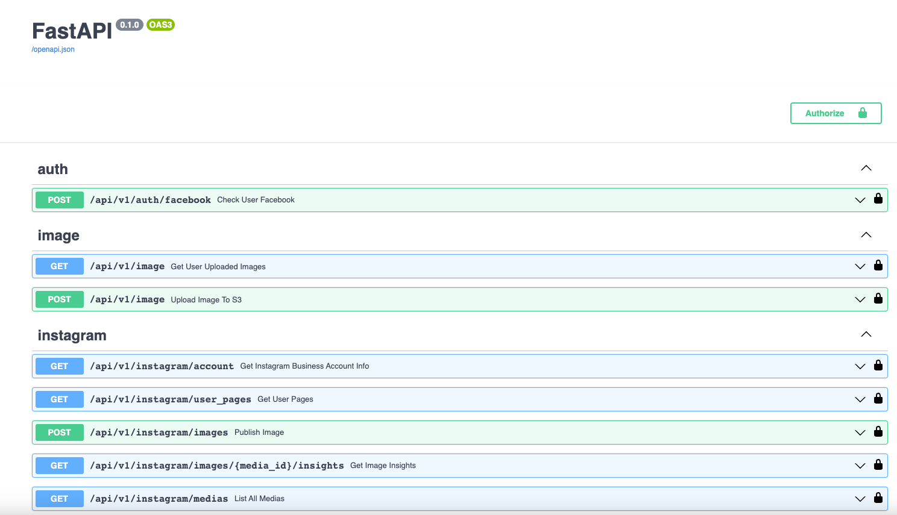
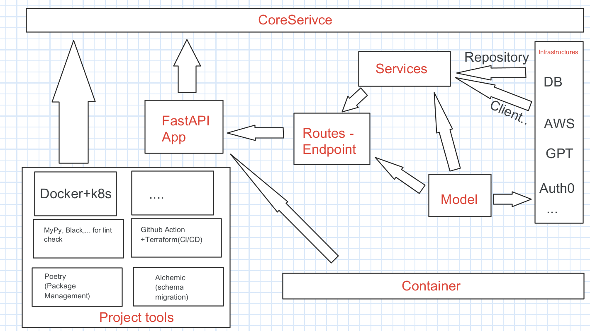

# Instagram-Graph-API

## Introduction
This is a service that integrates with Instagram's Graph API to:</br>
● Post media (image or video)</br>
● Retrieve engagement statistics for the uploaded content.

## How to set up
### Quick start
Follow this [quick start guide](https://github.com/rednafi/fastapi-nano#quickstart)
 on basic how-to-run for a FastAPI project with Docker, OpenAPI Interface, ...
### How to add new dependency and run with Poetry
First of all, this project will follow [PEP 505](https://peps.python.org/pep-0508/)
please refer to the link, and we will use Poetry to manage our packaging versioning (You can think it will like Pip with lock version of Nodejs).

Set to install:
1. Install "Poetry" in your local development, please follow the guide here [Poetry](https://python-poetry.org/docs/)
2. To add new dependency, please add in the [pyproject.toml](./pyproject.toml) file 
   - If that dependency is essential in the production env, please add that in the [tool.poetry.dependencies] section
or you can run the command:
    ```bash
        poetry add black
    ```
   - If that dependency is only needed for development env, please add it
in the production env, please add that in the [tool.poetry.group.dev.dependencies] section, or you can run the command:
    ```bash
        poetry add black -D
    ```
   - NOTE!!: Every time 
 you make the update to the dependency pyproject.toml file, 
please update the poetry.lock as well (if it not updates yet) by running
    ```bash
   poetry lock --no-update
    ```
ref: https://stackoverflow.com/questions/58961497/how-to-update-poetrys-lock-file-without-upgrading-dependencies

3. Next step

    For the installation in local you can do the following </br>
    Set up a venv in your local like this, for example
    ```bash
        python3.11 -m venv .venv
    ```
    and then run
    ```bash
        poetry config virtualenvs.in-project true --local
    ```
    to install core dependencies you run:
    ```shell
    poetry install --no-root 
    ```
    or run this if you don't want the dev dependencies
    ```shell
    poetry install --no-root --no-dev
    ```
    to run the application, test, or make lint you can do like this
    ```shell
    poetry run pytest
    ```
    ```shell
    poetry run make lint-check
    ```
    ```shell
    poetry run uvicorn app.main:app --port 5000 --reload
    ```
## How to authenticate
You must provide this service with the Access Token from your Instagram Professional account for Businesses, 
please follow the official documentation of Meta to set up the Account
and Retrieve the Access Token for using this service
(ref [Instagram Graph API](https://developers.facebook.com/docs/instagram-api/))

## How to use the service

I construct the service into several APIs that come with group 3:
- auth: for verify the Oauth access_token
- image: for upload the image to a blob storage (I use S3 in this case)
- instagram: for interaction with the graph instagram api

The api client of this service can implement the upload an image to an instagram business account
and see the insights for that post in this flow:
1. get the access_token from https://developers.facebook.com/tools/explorer or implement social login in the web/mobile to let the user grant the access to these permissions: 
`pages_show_list 
ads_management
business_management
instagram_basic
instagram_manage_insights
instagram_content_publish
pages_read_engagement`
2. Then, you have to retrieve the instagram_business_account_id; there are several ways to do that, you can do two ways:
   - If you have multiple pages on the App:
     1. Call GET /instagram/user_pages to query all pages that link to this account to have the page_id list
     2. Then, you can use the page_id to query the instagram_business_account_id by call GET /instagram/account
   - Or you can call GET /instagram/account without page_id params to query all data about instagram_business_account_id
3. Once you get the instagram_business_account_id, you can use it in POST /instagram/images:
- This API requires you to have the image_url of image or video hosted on your public server (https://developers.facebook.com/docs/instagram-api/guides/content-publishing/)
  - You can use some available image link to test
  - Or you can POST /image to upload an image file to S3 server and have a URL (this URL will live for an hour)
4. Then, call POST /instagram/images to start publishing the image to your IG account, when success it will return with a media_id
5. Use this media_id to call GET /instagram/images/{media_id}/insights to query some stats for this post

## Appendix
### Dependency injection and inversion of control
If you are still not familiar with this concept, please do some research.
Here are some good resources: https://python-dependency-injector.ets-labs.org/introduction/di_in_python.html,
https://www.youtube.com/watch?v=J1f5b4vcxCQ&ab_channel=CodeAesthetic

In this project, I try to adapt the python-dependency-injector with our FastAPI to implement DI.
Please refer to their documentation and some tutorial, it is very helpful.
Https://python-dependency-injector.ets-labs.org/providers/index.html
https://python-dependency-injector.ets-labs.org/examples/index.html

### Testing

We will mostly use mock to test our code, please see some example code in the repo.
The point of test is to test "our code"—meaning the code we wrote, including unittest (function, class,..) 
to integration level test (put some part of code together).

So please do test on the code you wrote, integration test is a must for delivering an API.
For another external part of the system like Auth0, DB, AWS, ... you don't have to test that.

### CI/CD

- Using GitHub Action to run the automation flow or to deploy as well
- For the deployment currently we can run this whole application in a single docker-compose

### DB Change Management 

Currently, sqlalchemy doesn't support update when model changing (it can only create new table).
The solution is to use Alembic to do that.
Please refer here to some tutorial: [Alembic](https://alembic.sqlalchemy.org/en/latest/tutorial.html)

So if you have some updates to the db models, please help update Alembic folder as well,
Here are some steps to follow when update db:
1. Config DB credentials:
```bash
   export DB_URL <something>
```
Alternative way is changing sqlalchemy.url the [alembic.ini](./alembic.ini) 
but please do it only in localhost, don't commit that

2. Create a Migration Script:
```bash
   alembic revision -m "create account table"
```
this command will create a file in alembic/development if you want to use production env:
```bash
   alembic --name production revision -m "create account table"
```

3. Update your Migration Script
4. Run to apply changes:
```bash
   alembic upgrade head
```
or
```bash
   alembic --name production upgrade head
```


### Configuration

We will use [config.yml](./config.yml) to set some of the configuration variables for our project.
Some important note!!: 
- For some config like this ${AWS_ACCESS_KEY_ID}, ${ENV_NAME}, ... meaning they are the 
environment variable in your local machine, or they can be set in the run time of the application, ...
please refer to this to update on those settings on macOS, Window, Ubuntu.
- ${ENV_NAME:"local"} meaning it will look for your env if not it get default as "local" 
- For ${AWS_SECRET_ACCESS_KEY} please read this https://docs.aws.amazon.com/powershell/latest/userguide/pstools-appendix-sign-up.html
- Some section in the yaml file has the structure like this:
```yaml
    s3_image_bucket:
      production: "sensayai-images"
      development: "sensayai-images-dev"
      local: "sensayai-images-local"
```
meaning they can switch-variant base on the ENV_NAME you currently running, 
so if you want you can update those sections to update the variable for 
the environment you want to run the application on
- reference: https://python-dependency-injector.ets-labs.org/providers/configuration.html

### Architecture - Project Structure
| Layer Name       | Description                                                                                                                                                                                                   | Dependencies |
|------------------|---------------------------------------------------------------------------------------------------------------------------------------------------------------------------------------------------------------|--------------|
| Models           | This define domain models. The business logic should be implemented in this package, some example to put in models are: db entity/object, some modeling of the application, api input/output schema object... | No           |
| Infrastructures  | This handles the external interaction like DB, GoogleSheet, Auth0, and etc. Within this project, library exposing data structure should be converted into the domain models                                   | Yes          |
| Services         | This should implement use cases using infrastructures & domain-models.                                                                                                                                        | Yes          |
| Routes -Endpoint | This should include the code run an application and application specific logic like HTTP Endpoint or background workers                                                                                       | Yes          |
| Container        | This will include the Dependency Injector Container to provide and wire up the dependency for the application                                                                                                 | ---          |
| Other tooling    | Other tool like Docker, Script, GithubAction, Alchemic, Poetry ... will set up along with this service as well to help set up the project and deployment                                                      | ---          |


The image bellow shows the overview of this architecture


(The arrow meaning: Service <--- Model means that the Service layer will have the dependency from Model layer)
